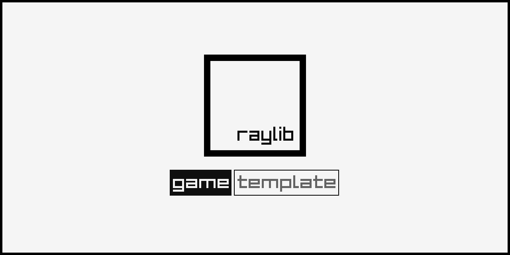

## Getting Started with this template

### Windows: Visual Studio

- After extracting the zip, the parent folder `raylib-game-template` should exist in the same directory as `raylib` itself.  So, your file structure should look like this:
    - Some parent directory
        - `raylib`
            - the contents of https://github.com/raysan5/raylib
        - `raylib-game-template`
            - this `README.md` and all other raylib-game-template files
- If using Visual Studio, open projects/VS2022/raylib-game-template.sln
- Select on `raylib_game` in the solution explorer, then in the toolbar at the top, click `Project` > `Set as Startup Project`
- Now you're all set up!  Click `Local Windows Debugger` with the green play arrow and the project will run.

### Linux

When setting up this template on linux for the first time, install the dependencies from this page:
([Working on GNU Linux](https://github.com/raysan5/raylib/wiki/Working-on-GNU-Linux))

You can use this templates in a few ways: using Visual Studio, using CMake, or make your own build setup. This repository comes with Visual Studio and CMake already set up.

Chose one of the follow setup options that fit in you development environment.

### CLI: Makefile

```sh
mkdir ~/raylib-gamejam && cd ~/raylib-gamejam
git clone --depth 1 --branch 6.0 https://github.com/raysan5/raylib
make -C raylib/src
git clone https://github.com/UtsavLaheru/Project-V.git
cd Project-V
make -C src
src/raylib_game
```

This template has been created to be used with raylib (www.raylib.com) and it's licensed under an unmodified zlib/libpng license.

_Copyright (c) 2014-2026 Ramon Santamaria ([@raysan5](https://github.com/raysan5))_

-----------------------------------
# THE GAMES TITLE IS STILL UNDER DEVELOPMENT SO WE ARE GOING TO USE THE DEVELOPMENT NAME. 

## PROJECT V



### Description

This is a simple Platform Shooter Game.

### Features

 - Short Story
 - Shooting
 - Little Bit of Platfroming
 - Sorry, The Game Is Not Developed Yet New Features Will Be Add Later.

### Controls

Keyboard:
 - WASD / ←↑→↓ (arrow keys) for movements 
 - E to Interact
 <!-- - I for Inventory -->

### Screenshots

_TODO: Show your game to the world, animated GIFs recommended!._

### Developers
 - Me (Utsav Laheru)

<!-- This fileds are pending please fill this filed after some good Developents -->
### Links

 <!-- - YouTube Gameplay: $(YouTube Link) -->
 - itch.io Release: $(itch.io Game Page)
 <!-- - Steam Release: $(Steam Game Page) -->

*Copyright (c) 2026 Utsav Laheru ([@UtsavLaheru](https://github.com/UtsavLaheru))*
